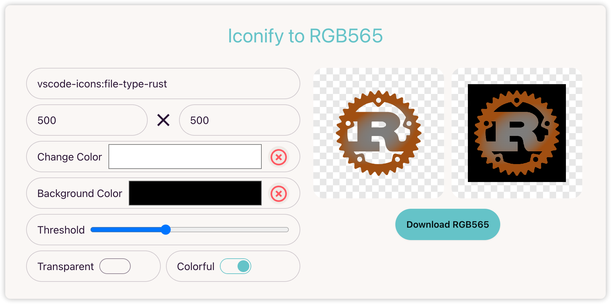

# Embedded Icon Tools Online

A WebApp tool for image format conversion for embedded development.



## Building the App

### Install the dependencies

```bash
npm install
```

### Build the app

```bash
npm run build
```

### Run the app

```bash
npm run start
```

the app will be available at `http://localhost:4173`.

Learn more on the [Solid Website](https://solidjs.com).

## Development

```bash
npm run dev
```

the app will be available at `http://localhost:24030`.

## License

MIT License.
